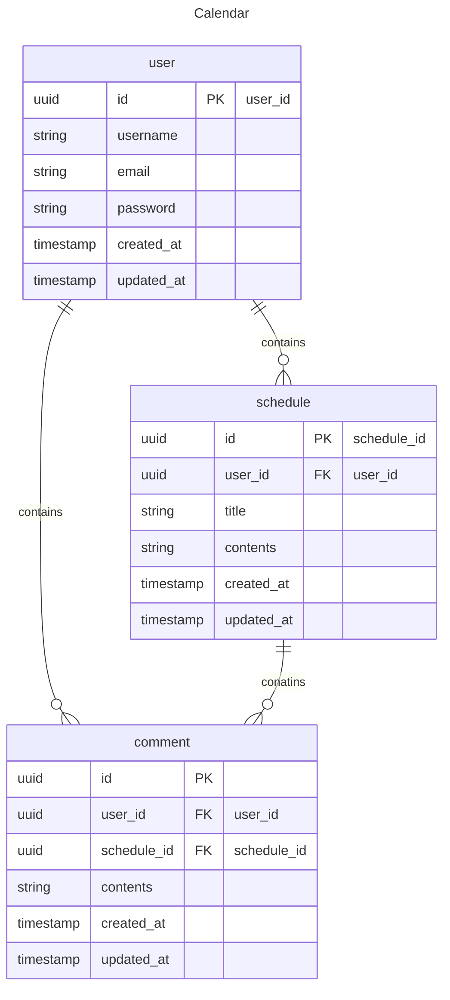

# SpringProject - ScheduleJpa

# 💻 프로젝트 소개
Spring을 이용해 만들었던 일정 프로젝트에서 Jdbc를 Jpa로 변경하여 업그레이드한 프로젝트입니다

# ⏰ 개발 기간
* 24.12.11 ~ 24.12.13

---
# 📈 ERD 다이어그램


---
# 📌 API 명세서

- ## [유저](#user)
- ## [일정](#schedule)
- ## [댓글](#comment)

## 유저<a id="user"></a>

| Method   | URL             | Description | Request |
|----------|-----------------|-------------|---------|
| `POST`   | `/users/signup` | 유저 생성       | Body
| `POST`   | `/users/login`  | 로그인         | Body
| `POST`   | `/users/logout` | 로그아웃        | None
| `GET`    | `/users/{id}`   | 유저 단건 조회    | Param
| `PATCH`  | `/users/{id}`   | 유저 수정       | Body
| `DELETE` | `/users/{id}`   | 유저 삭제       | Param
---
### 1. 유저 생성 (POST)

| 필드명        | 필수 여부 | 데이터 타입      | 설명               | 
|------------|-----------|-----------------|------------------|
| `username` | ✅        | `String`        | 사용자 이름 (최대 10자)  | 
| `email`    | ✅        | `String`        | 유효한 이메일 형식 (정규식) | 
| `password` | ✅        | `String`        | 비밀번호 (최소 4자리)    | 

- ### Response

> Success : 201 Created
```json
{
  "id": 1,
  "username": "이우진",
  "email": "test@test.com"
}
```
> 이름이 10자 넘어가는 경우 : 400
```json
{
    "username": "이름은 10글자를 넘을 수 없습니다."
}
```
>이메일 형식이 안맞는 경우 : 400
> 
```json
{
    "email": "올바른 이메일형식을 입력하세요."
}
```
>이메일이 이미 존재하는 경우 : 400
```json
{
"error": "이미 사용중인 이메일입니다."
}
```
>비밀번호가 4자리 이하인 경우 : 400
```json
{
    "password": "비밀번호는 최소 4자리부터 사용 가능합니다."
}
```
---
### 2. 유저 로그인 (POST)
| 필드명        | 필수 여부 | 데이터 타입   | 설명   |
|------------|-----------|----------|------|
| `email`    | ✅        | `String` | 이메일  |
| `password` | ✅        | `Long`   | 비밀번호 |

- ### Response
> Success : 200 OK

> 아이디나 비밀번호가 일치하지 않을 경우 : 400
```json
{
    "error": "아이디나 비밀번호가 일치하지 않습니다."
}
```
---
### 3. 유저 로그아웃 (POST)
- ### Response
> Success : 200 OK
---
### 4. 유저 단건 조회 (GET)
| 필드명        | 필수 여부 | 데이터 타입   | 설명    |
|------------|-----------|----------|-------|
| `id`       | ✅        | `Long`   | 유저 ID |

- ### Response
> Success : 200 OK
```json
{
  "id": 1,
  "username": "이우진",
  "email": "test@test.com"
}
```
> 존재하지 않는 아이디인 경우 : 404
```json
{
    "error": "존재하지 않는 유저 입니다."
}
```
---
### 5. 유저 수정 (PATCH)
| 필드명           | 필수 여부 | 데이터 타입      | 설명              | 
|---------------|-----------|-----------------|-----------------|
| `username`    | ❌        | `String`        | 사용자 이름 (최대 10자) | 
| `oldPassword` | ❌        | `String`        | 기존 비밀번호         | 
| `newPassword` | ❌        | `String`        | 새 비밀번호          | 
- ### Response
> Success : 200 OK

> 수정하려는 유저가 로그인한 본인이 아닌 경우 : 401
```json
{
    "error": "본인의 계정이 아닙니다."
}
```
> 기존 비밀번호가 일치하지 않는 경우 : 400
```json
{
    "error": "기존 비밀번호가 일치하지 않습니다."
}
```
> 기존 비밀번호와 새 비밀번호 중 하나만 입력한 경우 : 400
```json
{
    "error": "기존 비밀번호와 새 비밀번호를 둘다 입력해주세요."
}
```
---
### 6. 유저 삭제 (DELETE)
| 필드명        | 필수 여부 | 데이터 타입   | 설명    |
|------------|-----------|----------|-------|
| `id`       | ✅        | `Long`   | 유저 ID |

- ### Response
> Success : 200 OK


> 수정하려는 유저가 로그인한 본인이 아닌 경우 : 401
```json
{
    "error": "본인의 계정이 아닙니다."
}
```
---
## 일정 <a id="schedule"></a>

| Method   | URL             | Description | Request |
|----------|-----------------|-------------|---------|
| `POST`   | `/schedules` | 일정 생성       | Body
| `GET`    | `/schedules/`   | 일정 전체 조회    | Param
| `GET`    | `/schedules/{id}` | 일정 단건 조회    | Param
| `PATCH`  | `/schedules/{id}` | 일정 수정       | Body
| `DELETE` | `/schedules/{id}` | 일정 삭제       | Param
---
### 1. 일정 생성 (POST)

| 필드명        | 필수 여부 | 데이터 타입      | 설명    | Request |
|------------|-----------|-----------------|-------|---------|
| `title`    | ✅        | `String`        | 일정 제목 | Body    |
| `contents` | ✅        | `String`        | 일정 내용 | Body    |


- ### Response

> Success : 201 Created
```json
{
  "id": 1,
  "username": "이우진",
  "title": "제목3",
  "contents": "내용3",
  "createdAt": "2024-12-13T18:57:13.9178818",
  "updatedAt": "2024-12-13T18:57:13.9178818",
  "commentCount": 0
}
```
> 제목이나 내용이 비어있을 경우 : 400
```json
{
    "contents": "공백일 수 없습니다"
}
```
---
### 2. 일정 전체 조회 (GET)
| 필드명          | 필수 여부 | 데이터 타입 | 설명                       | Request |
|--------------|-----------|--------|--------------------------|---------|
| `pageNumber` | ❌         | `int`  | 가리킬 페이지 (default = 1)    | Param   |
| `pageSize`   | ❌         | `int`  | 페이지당 요소 개수 (default = 5) | Param      | 
- ### Response
>Success : 200 OK
```json
{
    "contents": [
        {
            "id": 2,
            "username": "이우진",
            "title": "제목3",
            "contents": "내용3",
            "createdAt": "2024-12-13T18:59:20.394866",
            "updatedAt": "2024-12-13T18:59:20.394866",
            "commentCount": 0
        },
        {
            "id": 1,
            "username": "이우진",
            "title": "제목3",
            "contents": "내용3",
            "createdAt": "2024-12-13T18:57:13.917882",
            "updatedAt": "2024-12-13T18:57:13.917882",
            "commentCount": 0
        }
    ],
    "currentPage": 2,
    "totalPages": 2
}
```
---
### 3. 일정 수정 (PATCH)
| 필드명        | 필수 여부 | 데이터 타입      | 설명    | Request |
|------------|-----------|-----------------|-------|---------|
| `title`    | ❌        | `String`        | 일정 제목 | Body    |
| `contents` | ❌        | `String`        | 일정 내용 | Body    |
- ### Response
>Success : 200 OK


> 제목이나 내용이 "" 또는 " "인 경우 : 400
```json
{
    "contents": "공백일 수 없습니다."
}
```
> 타인의 글을 작성하려는 경우 : 401
```json
{
    "error": "본인이 작성한 글이 아닙니다."
}
```
---
### 4. 일정 삭제 (DELETE)
| 필드명        | 필수 여부 | 데이터 타입   | 설명    | Request |
|------------|-----------|----------|-------|---------|
| `id`       | ✅        | `Long`   | 일정 ID | Param   |
- ### Response
>Success : 200 OK

> 타인의 글을 삭제하려는 경우 : 401
```json
{
    "error": "본인이 작성한 글이 아닙니다."
}
```
---
## 댓글<a id="comment"></a>

| Method   | URL                                 | Description | Request |
|----------|-------------------------------------|-------------|---------|
| `POST`   | `{scheduleId}/comments`             | 댓글 생성       | Body
| `GET`    | `{scheduleId}/comments`             | 댓글 전체 조회    | Param
| `PATCH`  | `{scheduleId}/comments/{commentId}` | 댓글 수정       | Body
| `DELETE` | `scheduleId}/comments/{commentId}`  | 댓글 삭제       | Param
---
### 1. 댓글 생성 (POST)
| 필드명        | 필수 여부 | 데이터 타입      | 설명    | Request |
|------------|-----------|-----------------|-------|---------|
| `scheduleId`    | ✅        | `String`        | 일정 ID | Param   |
| `contents` | ✅        | `String`        | 댓글 내용 | Body    |
- ### Response
>Success : 201 CREATED
```json
{
    "id": 1,
    "username": "이우진",
    "contents": "하이하이",
    "createdAt": "2024-12-13T19:55:26.1244593",
    "updatedAt": "2024-12-13T19:55:26.1244593"
}
```
> 존재하지 않는 일정에 댓글 생성을 시도할 경우 : 404
```json
{
    "error": "존재하지 않는 일정입니다."
}
```
---
### 2. 댓글 조회 (GET)
| 필드명        | 필수 여부 | 데이터 타입      | 설명    | Request |
|------------|-----------|-----------------|-------|---------|
| `scheduleId`    | ✅        | `String`        | 일정 ID | Param   |
- ### Response
>Success : 200 OK
```json
[
    {
        "id": 2,
        "username": "이우진",
        "contents": "하이하이2",
        "createdAt": "2024-12-13T19:57:09.003695",
        "updatedAt": "2024-12-13T19:57:09.003695"
    },
    {
        "id": 1,
        "username": "이우진",
        "contents": "하이하이",
        "createdAt": "2024-12-13T19:55:26.124459",
        "updatedAt": "2024-12-13T19:55:26.124459"
    }
]
```
> 존재하지 않는 일정에 댓글 생성을 시도할 경우 : 404
---
### 3. 댓글 수정 (PATCH)
| 필드명          | 필수 여부 | 데이터 타입      | 설명    | Request |
|--------------|-----------|-----------------|-------|---------|
| `scheduleId` | ✅        | `String`        | 일정 ID | Param   |
| `commentId`  | ✅        | `String`        | 댓글 ID | Param   |
| `contents`   | ✅        | `String`        | 댓글 내용 | Body    |
- ### Response
>Success : 200 OK


> 제목이나 내용이 "" 또는 " "인 경우 : 400
```json
{
    "contents": "공백일 수 없습니다."
}
```
> 타인의 글을 수정하려는 경우 : 401
```json
{
  "error": "본인이 작성한 댓글이 아닙니다."
}
```
---
### 4. 댓글 삭제 (DELETE)
| 필드명        | 필수 여부 | 데이터 타입   | 설명    | Request |
|------------|-----------|----------|-------|---------|
| `scheduleId`       | ✅        | `Long`   | 일정 ID | Param   |
| `commentId`  | ✅        | `String`        | 댓글 ID | Param   |
- ### Response
>Success : 200 OK

> 타인의 글을 삭제하려는 경우 : 401
```json
{
    "error": "본인이 작성한 댓글이 아닙니다."
}
```
